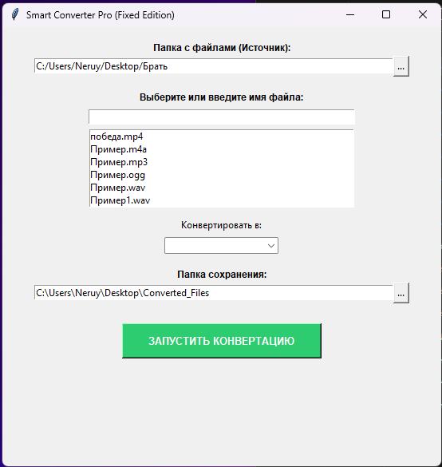

# Smart Converter Pro

**Smart Converter Pro** — это десктопное приложение на Python для быстрой и удобной конвертации файлов различных типов: изображений, текстов, аудио и видео. Приложение работает локально, обеспечивая высокую скорость и приватность данных.

## Функциональность
* **Конвертация медиа:** Преобразование аудио и видео форматов с использованием кодеков FFMPEG.
* **Работа с документами:** Извлечение текста из `.pdf` и `.docx` (включая таблицы) и сохранение в новый формат.
* **Умный интерфейс:** Автоматическое определение типа файла и предложение только подходящих форматов для конвертации.
* **Многопоточность:** Обработка файлов происходит в фоновом режиме, не блокируя интерфейс программы.

## Технологический стек
* **Язык:** Python 3.10+
* **Библиотека интерфейса:** Tkinter
* **Обработка документов:** PyPDF2, python-docx, fpdf
* **Обработка медиа:** imageio-ffmpeg
* **Работа с изображениями:** Pillow

## Архитектура приложения
Проект реализован с разделением логики и интерфейса:
1. **FileProcessor (Logic Layer):** Статический класс, содержащий алгоритмы обработки файлов.
2. **SmartConverterPro (UI Layer):** Класс, отвечающий за визуальное представление и взаимодействие с пользователем через события.
3. **Threading:** Использование модуля `threading` для изоляции тяжелых вычислений от основного потока GUI.

## Установка и запуск
Вам всего-лишь нужно скачать "SmartConverterPro.exe" и открыть. Всё
